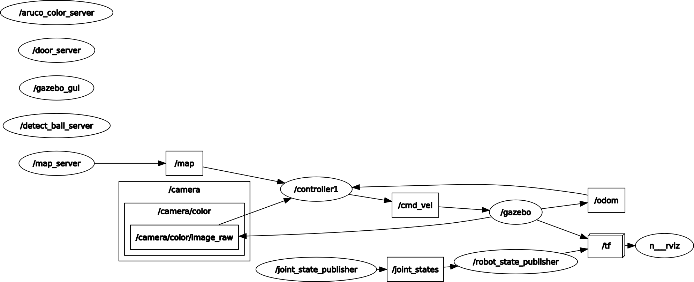

# RQT Graph
> 
# Explanation:
## Nodes we created:
> Controller
> - This node is subscribed to the /odom, /camera/color/image_raw and /map topics to get information
> - This node then calculates the bot's path using A star algorithm explained <a href="https://github.com/sid-5/ROS_VICHESTA/blob/master/docs/problem_statement.md">here</a> to calculate the path of the bot and publishes the required information to /cmd_vel to localize the bot
> - When the path reaches certain way-points in the map this node sends the information form the subscribed node to the servers for performing ball detection(explained <a href="https://github.com/sid-5/ROS_VICHESTA/blob/master/docs/workflow2.md">here</a>), aruco id and box colour detection(explained <a href="https://github.com/sid-5/ROS_VICHESTA/blob/master/docs/workflow2.md">here</a>) and door colour detection(explained <a href="https://github.com/sid-5/ROS_VICHESTA/blob/master/docs/workflow2.md">here</a>)

## Service files we created:
> Detect_ball_server
> - Using OpenCV we detect contours having the specific colour of the ball and count the number of balls in a specific image
> - This server receives a message of type sensor_msgs/Image and returns an integer
> 
> Door_server
> - Using OpenCV we detect contours having the specific colour on the door and make an array of these colours according to the order of the doors
> - This server receives a message of type sensor_msgs/Image and returns one integer array containing the x-coordinate of the center of contour and a string array of colours
> 
> Aruco_color_server
> - Using openCV we detect the aruco marker ids and detect the box colour contours above them having the specific colour
> - This server receives a message of type sensor_msgs/Image and returns an integer array containing aruco ID and a string array containing the associated colours
