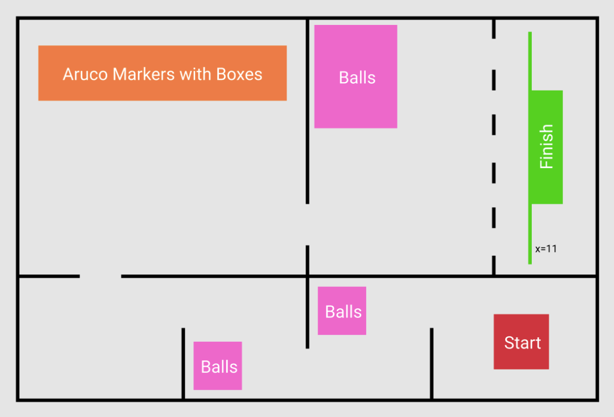

# Problem Statement and Description of the task

### Brief

> - The bots that navigate autonomously, it is a necessity to test the working of their path planning algorithms.
> 
> - The task is to develop and refine a path planning algorithm that would allow a robot to navigate the given > environment.

### **Problem Statement**

> The team is provided with a ROS package that contains the simulation
> environment and a four-wheel robot model. The robot model has the following sensors:

**Sensors**
```
● 2D LIDAR

● Intel Realsense D435i RGBD Camera

● IMU
```

The arena designed in the package is as follows :


<br />

> The environment contains some balls (present only in the marked regions) and has 5 tables on
> top of which different colored boxes are present. Below each table, an `aruco` marker with a
> unique id is placed.
> 
> ● The bot has to count the total number of balls present in the environment, let say it is `X`.
> 
> ● Then you have to calculate `Y` which is equal to the remainder when X is divided by `5`.
> Mathematically, `Y = X % 5`, where % represents the modulo operator that gives the
> remainder when `X` is divided by `5`.
> 
> ● Then you have to find the `aruco` marker which has the id `Y` and store the color of the box
> placed above that particular marker. Let the color is `C`.
> 
> ● Before the finish area, there are some colored doors. The bot has to enter the finish area
> through the door having the color `C`.
> 
> ● The bot has to cross the coordinate line x=11 to finish the task


### **Description**

**System Requirements**

> You will need to have Ubuntu 18.x LTS (Bionic Beaver) installed to successfully set up
> the environment. ROS melodic preferred as a ros flavour.

#### **Reference Material**

> Download a ISO file from [here](https://releases.ubuntu.com/18.04/)
> 
> Follow the installation instructions from [here](https://github.com/sid-5/ROS_VICHESTA/blob/master/README.md)

### **Reference Table**

| Workflow Part 1  	| [File link](https://github.com/sid-5/ROS_VICHESTA/blob/master/docs/workflow1.md)    	|
|------------------	|-------------------------------------------------------------------------------------	|
| Workflow Part 2  	| [File link](https://github.com/sid-5/ROS_VICHESTA/blob/master/docs/workflow2.md)    	|
|------------------	|-------------------------------------------------------------------------------------	|
| A-Star Algorithm 	| [A-Star Analysis](https://github.com/sid-5/ROS_VICHESTA/blob/master/docs/a-star.md) 	|
