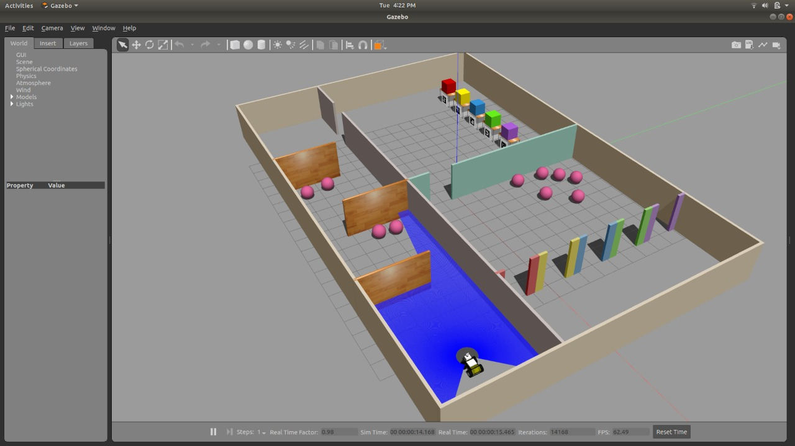

# Project Workflow Detailing

### **Workflow**

> 

### **Explanation**

> - The bot starts at the start position assigned to it. It checks the obstruction and moves to the next room.

> - As the bot enters the new room, it counts the number of balls kept directly in front of it and stores the number. The bot then starts traveling forward avoiding the obstacle to the 2nd room.

> - The bot again detects and counts the number of balls and adds the number to the previously stored count. It then proceeds to the room with the Aruco markers.

> - The next task for the bot is to read the Aruco markers and color detection. This will be explained on the next page.

#### Navigation

> 

> We have used the A-star algorithm for path planning of the bot's route to complete the task.

# Dheeraj add karde aage

: