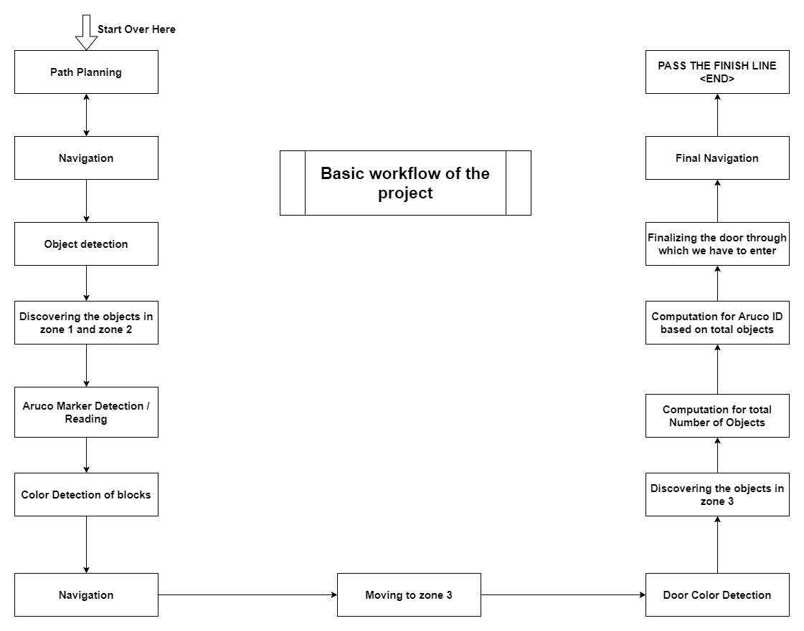
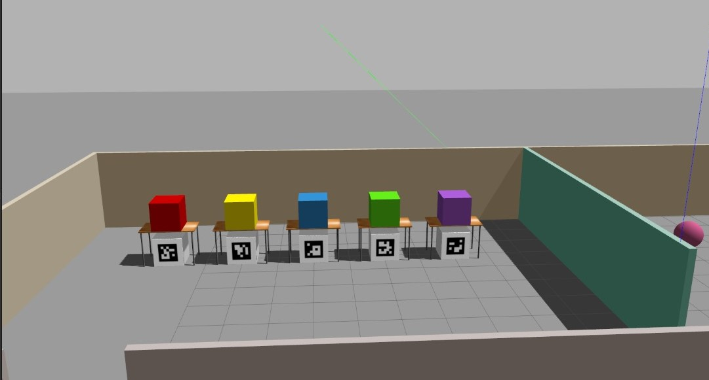

# Project Workflow Detailing

### **Workflow**

> 

### **Explanation**

> > **Ball Detection**
> > 
> > 
> - Now as the bot has counted the number of balls in zone 1 and zone 2 so the first half of the problem is done.
> 
> > **Aruco Markers**
>  padding:25px 25px 25px 25px" width="700">
> 
> - The bot will navigate in the room and detection and reading of that `aruco` markers will take place. 
> After detection of the ID's of the `aruco` markers now the bot will locate all the balls in zone 3 and add them to the total number of balls found in zone 1 and zone 2.
> - Now as per the problem statement let the number of balls be `X`. Now we will compute the remainder of `X % 5`. Let's take that as `Y`.
> 
> - As mentioned we have to already scanned the `aruco` markers. Now we need to search for the `aruco` marker with `ID = Y` in our scanned array of ID's.
> 
> - After detection of that `aruco` marker, we need to find the color of the box which is kept on the top of that particular  `aruco` marker which is already scanned by the bot before moving on to the ball detection in zone 3. Let the color be `C`.
>
> - Now after the detection of the color the robot needs to navigate to the room which has `colored doors` to the finish line. 
>
> > **Colored Doors**
> > 
>  

>
> - When the bot enters the room of doors it scans the color of the doors and the center point also. So we store them as list in the program.
>
> - The center points are in association with the Y co-ordinate in gazebo. That means after detection of the doors and their respective color the computation of the center point is made and stored. And hence we move on to the ball detection in zone 3.
>
> - After the total number of ball detection is done with the computation too, the bot needs to pass through that particular door with `color C` and cross the finish line to accomplish the task.
> 
> - After doing so the task will get over.
