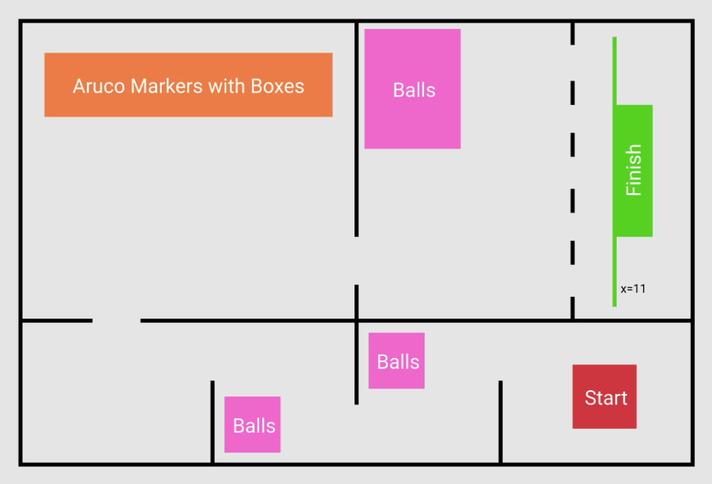

# Problem Statement and Description of the task

The team is provided with a ROS package that contains the simulation
environment and a four-wheel robot model. The robot model has the following sensors:

**Sensors**
```
● 2D LIDAR

● Intel Realsense D435i RGBD Camera

● IMU
```

The arena designed in the package is as follows :



